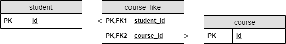

### postgres text vs varchar
TEXT
Usage: Used for storing large amounts of text data.
Storage: Typically stored outside the main table row, with a pointer to the actual data.
Limit: Can store very large strings (up to 1 GB in PostgreSQL).
Performance: May have different performance characteristics compared to VARCHAR, especially for very large text.

VARCHAR
Usage: Used for storing variable-length strings.
Storage: Stored directly in the table row.
Limit: You can specify a maximum length (e.g., VARCHAR(255)). In PostgreSQL, VARCHAR without a length specifier behaves like TEXT.
Performance: Generally faster for smaller strings and when a length limit is specified.

### Implementing Many to Many

student, likes, course

in the student class
```java
@ManyToMany
@JoinTable(
  name = "course_like", 
  joinColumns = @JoinColumn(name = "student_id"), 
  inverseJoinColumns = @JoinColumn(name = "course_id"))
Set<Course> likedCourses;
```
in the course class
```java
@ManyToMany(mappedBy = "likedCourses")
Set<Student> likes;
```

More implementation like composite key: https://www.baeldung.com/jpa-many-to-many
